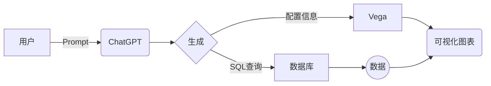
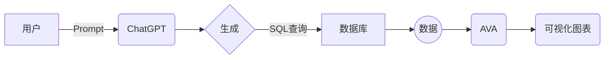

> 最近很多朋友经常会在朋友圈转发和讨论关于 AIGC 技术未来的思考，以及如何将它应用到互联网产品中。AIGC 技术中最为大家熟知的就是 OpenAI 发布的 ChatGPT 了。最近笔者也经常思考如何将它跟现有的业务场景结合。而恰巧最近在设计和开发一款 BI 系统，于是便尝试将 ChatGPT 与 数据可视化进行结合，便有了此文。

# 1. 前言

ChatGPT 是一种基于深度学习的自然语言处理技术，可以理解和生成人类语言。与其他自然语言处理技术不同，ChatGPT 可以自我训练和生成大量的文本数据。这使得 ChatGPT 成为了一个强大的工具，在多个领域都被广泛应用。

如果可以通过与 ChatGPT 对话的方式，自动提取数据和可视化分析。这将是一件非常 Amazing 的事情！

本文将探讨如何利用 ChatGPT 实现智能数据可视化方案。

# 2. 方案探索

使用过 ChatGPT 的朋友都知道，Prompt（提示词）是帮助我们使用 ChatGPT 技术的关键。Prompt 是一种简短的文本片段，用于向 ChatGPT 提供上下文信息和指导。Prompt 可以包含问题、任务描述、限制条件等，以便 ChatGPT 理解用户的需求并生成更准确的响应。

例如，在 BI 数据探索中，一个提示词可能是这样的：“请显示去年每个季度销售额最高的产品。”在这个提示词中，我们提供了时间范围、筛选条件和期望结果。ChatGPT 可以通过理解这个提示词，自动提取数据，并在图表中呈现出符合条件的产品和销售额数据。如果我们需要进一步了解某个产品的详细信息，我们只需要提供更具体的提示词，例如：“请给我展示去年第一季度销售额最高的产品的价格和库存情况。”

Prompt 的设计非常重要，因为它直接影响到 ChatGPT 的响应质量。好的 Prompt 应该具有以下特征：

1.  简洁明了：Prompt 应该简单明了，不包含冗余信息或模糊性，让 ChatGPT 更容易理解用户的需求。
2.  具体清晰：Prompt 应该具有足够的上下文信息，以便 ChatGPT 可以理解任务的目标和限制条件。例如，数据范围、筛选条件、期望结果等。
3.  范围明确：Prompt 应该限定任务的范围，避免让 ChatGPT 陷入无限循环或无法理解的情况。
4.  多样性：Prompt 应该包含多个变量和不同类型的提示词，以便 ChatGPT 可以从不同的角度理解用户需求并生成多样化的响应。

所以，要想充分利用 ChatGPT 技术来实现可视化分析，优化 Prompt 设计至关重要。笔者认为有两种思路可以考虑：第一种是通过 Prompt 引导 ChatGPT 生成个性化的可视化分析推荐，并将配置提交给声明式可视化语言（Vega），以便直接进行可视化展示；第二种是通过 Prompt 引导 ChatGPT 生成数据查询 SQL，然后使用社区中的自动化分析工具（例如 [AVA](https://ava.antv.antgroup.com/zh)）对获取的数据自动可视化展示。

下面将分别介绍这两种方案的实现。

## 2.1 方案 1：ChatGPT + Vega

Vega 是一种声明式的可视化语言，用于描述数据可视化图表和交互式视图。它支持多种图表类型，包括散点图、线图、柱状图、区域图等，并允许用户定义各种视觉属性，如颜色、大小和形状等。Vega 使用 JSON 语法，并提供一个基于 Web 的编辑器 Vega Editor，可以帮助用户快速创建和修改可视化图表。它还提供了一系列工具和库，如 Vega-Lite 和 Vega-Embed，以便在不同的应用场景中使用。

我们可以利用 Prompt 提供关键字、目标群体、所需的分析结果类型等上下文信息，ChatGPT 可以根据这些信息自动生成生命式可视化分析推荐，然后将其配置提交给声明式可视化语言 Vega，便可以实现自动数据可视化。

这种方法适用于需要高度个性化的场景。

实现流程如下：



首先用户提交合理的 Prompt 提交可视化需求给 ChatGPT，ChatGPT 通过 Prompt 自动生成数据查询 SQL 和 Vega 可视化 JSON 配置，然后将 SQL 提交给数据库获取分析数据集合，最后讲 Vega 配置信息和数据集输入给 Vega 渲染引擎，就可以绘制可视化图表了。

实现效果如下：


可以通过此链接查看 [Prompt](https://github.com/chatbi/chatbi/blob/main/src/modules/chat/chat.service.ts#L125)

## 2.1 方案 2：ChatGPT + AVA

**AVA** (A Visual Analytics) 是为了更简便的可视分析而生的技术框架。它是出自阿里巴巴集团（_Alibaba_）技术框架（又一个出自阿里大厂的开源框架，说实话，阿里国内我最喜欢的开源贡献大厂，没有之一！），其目标是成为一个自动化（_Automated_）、智能驱动（_AI driven_）、支持增强分析（_Augmented_）的可视分析解决方案。

AVA 的整体架构如下：


依赖 AVA 框架的强大设计，我们只需要提供数据给它，它就会基于输入的数据集，自动进行分析和洞察。所以，方案 2 的核心就是如何快速精准的获取到用户想要的数据。

实现流程如下：



利用 Prompt 包含数据范围、筛选条件等上下文信息，ChatGPT 可以自动生成相应的 SQL 查询语句。然后再将 SQL 提交给数据库获取数据，最后交给 AVA，自动实现数据分析和洞察分析。

实现效果如下：


可以通过此链接查看 [Prompt](https://github.com/chatbi/chatbi/blob/main/src/datasource/datasource.ts#L91)

# 3. 项目源码

两种方案代码比较简单，这里就不贴出来了，感兴趣可以直接阅读项目源码。[ChatBI](https://github.com/chatbi/chatbi)

项目服务端使用 NestJS 实现，前端使用 UmiJS + React + Antd。

项目服务端运行前，需要拥有 OpenAI 平台的 `API KEY`，如果国内用户没法获取，可以通过 [AIGCaaS](https://www.aigcaas.cn) 平台获取 `Secret ID` 和 `Secret Key`。直接配置到项目根目录的 `.env` 文件即可。

文章 banner 图，就是通过 AIGCaaS 平台提供的 [Open Journery API](https://www.aigcaas.cn/home/api/explorer?product=66&api=default) 生成的。生成 Prompt 配置如下：

- 图片宽度：`800`
- 图片高度：`480`
- 文本（Prompt）：
  ```text
  (((best quality))),single build,architecture, blue\_sky, building,cloudy\_sky, day, fantasy, fence, field, house, build,architecture,landscape, moss, outdoors, overgrown, path, river, road, rock, scenery, sky, sword, tower, tree, waterfall , \<lora:Pyramid lora\_Ghibli\_v2:1>
  ```
- 反向描述内容(Negative prompt):
  ```text
  easynegative, ng_deepnegative_v1_75t,{{{{bad_construction}}}},{bad_structure},bad_wail,{{{bad_windows}}},{blurry},cloned_window,cropped,{{{deformed}}},{{{disfigured}}},error,{{{extra_windows}}},{extra_chimney},{{{extra_door}}},extra_structure,{{extra_frame}},{fewer_digits},{fused_structure},gross_proportions,jpeg_artifacts,{{{{long_roof}}}},low_quality,{structure_limbs},{{missing_windows}},{missing_doors},{{missing_roofs}},mutated_structure,{{{mutation}}},normal_quality,out_of_frame,owres,{{poorly_drawn_structure}},{{poorly_drawn_house}},signature,text,{{too_many_windows}},{{{ugly}}},username,uta,watermark,worst_quality
  ```

# 4. 总结

对比以上两种方案，不难看出，**Prompt 设计是实现 ChatGPT 技术可视化分析的关键**。通过合理设计 Prompt，我们可以更好地利用 ChatGPT 技术，并以更高效的方式进行数据挖掘和洞察。无论是使用个性化可视化分析推荐还是自动生成 SQL 查询语句并使用自动化分析工具，合理的 Prompt 设计都可以让我们比以往更轻松地发现数据中隐藏的价值。

当然除了 Prompt 设计，我们还需要考虑查询效率。我们不可能每次提交 Prompt 都通过 ChatGPT 进行回复，毕竟这个过程是很费时的，特别是对话上下文比较复杂的时候，即使使用 GPU 也可能需要数秒或以上的时间。因此，对 ChatGPT 结果进行缓存是很有必要的。

一种常见的缓存策略是将 ChatGPT 的输出结果与 Prompt 保存在一个键值对中，以 Prompt 为 key，ChatGPT 输出为 value。这样，在接收到新的 Prompt 时，我们可以首先在缓存中查找是否已经有对应的输出结果。如果找到了，直接返回缓存结果；否则，再调用 ChatGPT 进行计算，并将结果存入缓存中。具体方案还有好多，大家可以亲自尝试。

# 5. 未来展望

随着人工智能技术的不断发展，ChatGPT 等自然语言处理技术将变得更加强大和普及，并且更好地与可视化分析相结合，为用户提供更加直观和高效的数据洞察方式。

未来的可视化分析也将更加注重个性化和交互性。即使是同一份数据，在不同的用户需求下所呈现的图表也应该是不同的。因此，我们可以期待 ChatGPT 技术能够更好地理解个性化的 Prompt，并自动为每个用户生成符合其需求的图表和分析结果。此外，交互式探索和分析将成为趋势，这将不断冲击传统的人机交互方式。

智能化可视化分析还有许多可能的改进方向。例如，通过更深入的对话，ChatGPT 可以更好地了解用户的关注点和需求，并提供更精准的响应；通过结合知识图谱等知识库，ChatGPT 可以更好地理解复杂领域的专业术语和语义规则，从而更准确地生成分析结果。

写在最后，以上就是笔者近期使用 ChatGPT 的一些探索心得。对于 AIGC 技术，笔者也在不断学习中。希望本文能起到抛砖引玉的作用，如果大家有更好的思路，欢迎评论区留言。
